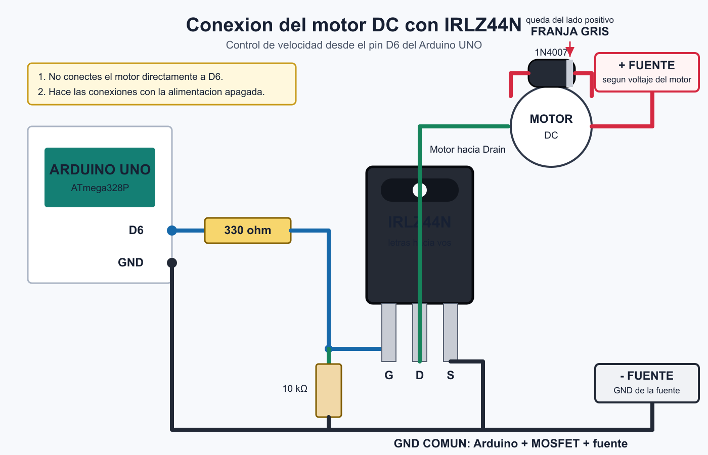

# Conexiones del armado fisico

Las conexiones siguientes corresponden al Arduino UNO R3 con ATmega328P. Se deben
realizar con el Arduino y la fuente externa apagados.

## Resumen de pines

| Elemento | Pin del elemento | Conexion en Arduino o circuito |
|---|---|---|
| LM35 | `+VS` | `5V` del Arduino |
| LM35 | `VOUT` | `A0` |
| LM35 | `GND` | GND comun |
| LCD I2C | `VCC` | `5V` del Arduino |
| LCD I2C | `GND` | GND comun |
| LCD I2C | `SDA` | `A4` |
| LCD I2C | `SCL` | `A5` |
| LED calefactor | Anodo, pata larga | `D8` mediante resistencia de 220 ohm |
| LED calefactor | Catodo, pata corta | GND comun |
| IRLZ44N | Gate (`G`) | `D6` mediante resistencia de 330 ohm |
| IRLZ44N | Drain (`D`) | Terminal negativo del motor |
| IRLZ44N | Source (`S`) | GND comun |
| Motor DC | Terminal positivo | Positivo de la fuente externa |
| Motor DC | Terminal negativo | Drain del IRLZ44N |
| Fuente externa | Negativo | GND comun |

## Alimentacion

- El Arduino se alimenta desde el cable USB.
- El LM35 y el LCD se alimentan desde los 5 V del Arduino.
- El motor se alimenta con una fuente externa apropiada para su voltaje.
- El negativo de la fuente externa debe unirse al GND del Arduino.
- El positivo de la fuente externa no se conecta al pin `5V` del Arduino mientras
  el Arduino esta conectado por USB.
- El motor no debe alimentarse directamente desde el pin `5V` del Arduino.

Todos los puntos GND forman una tierra comun: Arduino, LM35, LCD, MOSFET y negativo
de la fuente externa.

## Sensor LM35

Mirando la cara plana del LM35 hacia adelante y con las patas hacia abajo:

| Posicion | Conexion |
|---|---|
| Pata izquierda | `5V` |
| Pata central | `A0` |
| Pata derecha | `GND` |

El cuerpo negro del LM35 siente la temperatura. La pata central entrega 10 mV por
cada grado Celsius; por ejemplo, 0,30 V representan aproximadamente 30 C.

## LCD con modulo I2C

| LCD I2C | Arduino UNO |
|---|---|
| `GND` | `GND` |
| `VCC` | `5V` |
| `SDA` | `A4` |
| `SCL` | `A5` |

El programa utiliza la direccion I2C `0x27`. Si la pantalla enciende pero no se ve
el texto, se debe ajustar lentamente el tornillo de contraste del modulo.

## LED que representa el calefactor

```text
D8 --- resistencia de 220 ohm --- anodo del LED
GND ----------------------------- catodo del LED
```

## Motor, MOSFET y diodo

Mirando el IRLZ44N de frente, con las letras hacia adelante y las patas hacia
abajo, el orden es: Gate, Drain y Source (`G-D-S`).

```text
D6 --- resistencia de 330 ohm --- Gate
Gate --- resistencia de 10 kohm --- GND
Source ---------------------------- GND comun
Drain ----------------------------- terminal negativo del motor
Positivo de la fuente externa ----- terminal positivo del motor
Negativo de la fuente externa ----- GND comun
```

El diodo 1N4007 se coloca en paralelo con el motor:

- Extremo con franja gris: positivo de la fuente y del motor.
- Extremo sin franja: terminal negativo del motor y Drain del MOSFET.

No se necesita un puente H porque el motor solamente gira en un sentido. La
velocidad se controla mediante PWM desde `D6`.



## Comunicacion UART

La comunicacion UART se realiza mediante el cable USB del Arduino a 9600 baudios.
Los pines `D0` y `D1` se dejan libres para no interferir con la programacion ni con
el monitor serial.

## Conexion temporal para probar los rangos

Para simular temperaturas se desconecta completamente el LM35 de `A0` y se conecta:

```text
5V --- dos resistencias de 100 kohm en paralelo --- extremo del potenciometro
A0 ----------------------------------------------- cursor central
GND ---------------------------------------------- otro extremo
```

Con dos resistencias de 100 kohm en paralelo y un potenciometro de 10 kohm se
pueden simular aproximadamente de 0 a 83 C. Al terminar la prueba se retira este
circuito y se vuelve a conectar solamente el LM35 en `A0`.


