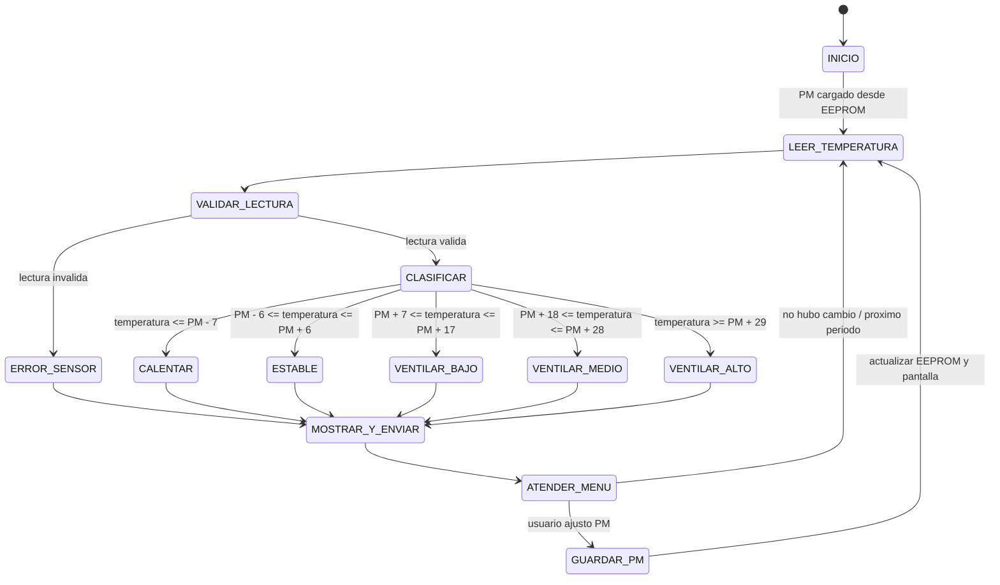

# Maquina de estados propuesta

Este documento describe el ciclo del controlador antes de escribir el codigo. La lectura se realiza cada cinco segundos, como pide el problema.

## Que significa cada paso

| Estado | Tarea |
|---|---|
| `INICIO` | Preparar entradas y salidas, leer el punto medio guardado. Si EEPROM no tiene un valor valido, usar 22 C. |
| `LEER_TEMPERATURA` | Solicitar una lectura al sensor cuando corresponda el periodo de cinco segundos. |
| `VALIDAR_LECTURA` | Comprobar que el sensor entrego un valor utilizable. |
| `CLASIFICAR` | Comparar la lectura con los limites calculados a partir de PM. |
| `CALENTAR` | Encender la salida que representa el calefactor y apagar el ventilador. |
| `ESTABLE` | Apagar calefactor y ventilador. |
| `VENTILAR_BAJO`, `VENTILAR_MEDIO`, `VENTILAR_ALTO` | Apagar calefactor y ordenar el nivel PWM correspondiente al ventilador. |
| `ERROR_SENSOR` | Apagar calefactor y ventilador; reportar error por UART y en pantalla. |
| `MOSTRAR_Y_ENVIAR` | Actualizar LCD y enviar temperatura/accion por UART. Si la lectura fallo, enviar el codigo de error. |
| `ATENDER_MENU` | Revisar si llego por UART una orden para consultar o cambiar PM. |
| `GUARDAR_PM` | Actualizar PM en memoria y guardarlo en EEPROM. |

## Ejemplo de clasificacion

Con `PM = 22 C` y una lectura de `42 C`:

1. La lectura es valida.
2. `42` esta entre `PM + 18` (40) y `PM + 28` (50).
3. El controlador elige `VENTILAR_MEDIO`.
4. Apaga la salida del calefactor, aplica el PWM medio y reporta la accion.

## Decisiones pendientes

- Elegir los valores PWM concretos con el motor disponible.
- Definir limites admitidos para PM y el texto exacto para los errores.
- Confirmar que la frecuencia de actualizacion del LCD y UART sea adecuada junto al periodo de lectura.
